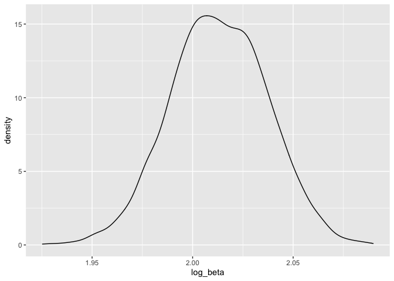
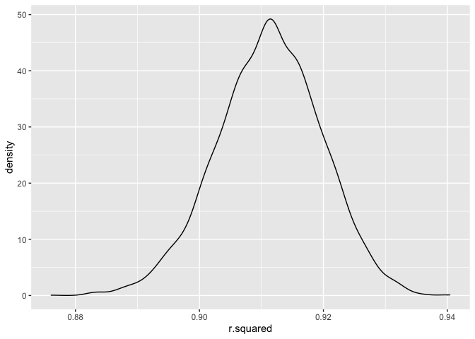
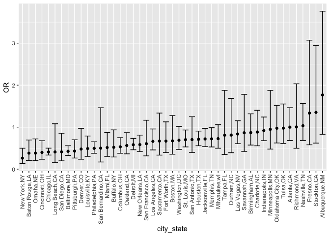
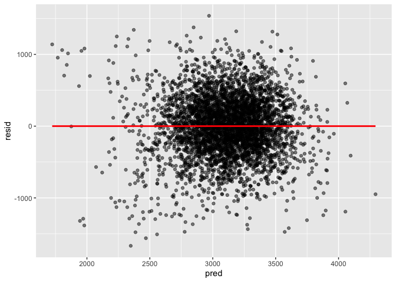
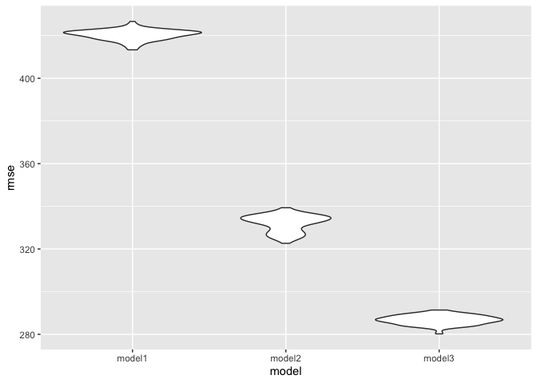

p8105_hw6_xx2416
================
Xicheng Xie
2022-11-29

``` r
library(tidyverse)
library(purrr)
library(modelr)
library(mgcv)
```

# Problem 1

-   Read the dataset

``` r
weather_df = 
  rnoaa::meteo_pull_monitors(
    c("USW00094728"),
    var = c("PRCP", "TMIN", "TMAX"), 
    date_min = "2017-01-01",
    date_max = "2017-12-31") %>%
  mutate(
    name = recode(id, USW00094728 = "CentralPark_NY"),
    tmin = tmin / 10,
    tmax = tmax / 10) %>%
  select(name, id, everything())
```

    ## Registered S3 method overwritten by 'hoardr':
    ##   method           from
    ##   print.cache_info httr

    ## using cached file: ~/Library/Caches/R/noaa_ghcnd/USW00094728.dly

    ## date created (size, mb): 2022-09-29 10:34:26 (8.401)

    ## file min/max dates: 1869-01-01 / 2022-09-30

-   Doing the bootstrap

``` r
weather_boots<-
weather_df %>% 
  bootstrap(n=5000) %>% 
  mutate(
    models=map(strap,~lm(tmax~tmin,data = .x)),
    results1=map(models,broom::tidy),
    results2=map(models,broom::glance))
```

-   Produce estimate of log(beta^0\*beta^1)

``` r
log_beta<-
  weather_boots %>% 
  select(.id,results1) %>% 
  unnest(results1) %>% 
  select(.id,term,estimate) %>% 
  pivot_wider(names_from = "term",
              values_from = "estimate") %>% 
  rename(beta0='(Intercept)',beta1='tmin') %>% 
  mutate(log_beta=log(beta0*beta1)) 

log_beta %>%
  pull(log_beta) %>% 
  quantile(c(0.025,0.975))
```

    ##     2.5%    97.5% 
    ## 1.965727 2.059626

``` r
log_beta %>% 
  ggplot(aes(x=log_beta))+
  geom_density()
```

<!-- -->

-   Produce estimate of r^2

``` r
r_squred<-
  weather_boots %>% 
  select(.id,results2) %>% 
  unnest(results2) %>% 
  select(.id,r.squared)

r_squred %>% pull(r.squared) %>% quantile(c(0.025,0.975))
```

    ##      2.5%     97.5% 
    ## 0.8940997 0.9271178

``` r
r_squred %>% 
  ggplot(aes(r.squared))+
  geom_density()
```

<!-- -->

# Problem 2

-   Read and clean the raw dataset.

``` r
homicide_df<-
  read.csv("homicide-data.csv") %>% 
  mutate(city_state=str_c(city,state,sep=','),
         resolved=as.numeric(disposition=="Closed by arrest"),
         victim_age=as.numeric(victim_age)) %>% 
  filter(!city_state %in% c("Dallas,TX","Phoenix,AZ","Kansas City,MO","Tulsa,AL")) %>%
  filter(victim_race %in% c("White","Black")) 
```

    ## Warning in mask$eval_all_mutate(quo): NAs introduced by coercion

-   Fit a logistic regression for the city of Baltimore,MD

``` r
baltimore_df<-
  homicide_df %>% 
  filter(city_state=="Baltimore,MD") %>% 
  select(resolved, victim_age, victim_race, victim_sex)

fit_logistic<-
  baltimore_df %>% 
  glm(resolved~victim_age+victim_race+victim_sex,data=., family = binomial())

fit_logistic %>% 
  broom::tidy() %>% 
  mutate(OR=exp(estimate),
         CI_lower=exp(estimate-std.error*qnorm(0.975)),
         CI_upper=exp(estimate+std.error*qnorm(0.975))) %>% 
  select(term,OR,starts_with("CI")) %>% 
  knitr::kable(digits = 3)
```

| term             |    OR | CI_lower | CI_upper |
|:-----------------|------:|---------:|---------:|
| (Intercept)      | 1.363 |    0.975 |    1.907 |
| victim_age       | 0.993 |    0.987 |    1.000 |
| victim_raceWhite | 2.320 |    1.648 |    3.268 |
| victim_sexMale   | 0.426 |    0.325 |    0.558 |

Based on the table, the estimate of the adjusted OR for solving
homicides comparing male victims to female victims is `0.426`, and the
95% confidence interval is from `0.325` to `0.558`, which means
homicides in which the victim is male are significantly less likely to
be resolved than those in which the victim is female.

-   Run `glm` for each of the cities in the `homicide_df`, and extract
    the adjusted OR and CI for solving homicides comparing male victims
    to female victims.

``` r
fit_logistic_all<-
  homicide_df %>% 
  nest(data=-city_state) %>% 
  mutate(
    models=map(data,~glm(resolved~victim_age+victim_race+victim_sex,data=.x, family = binomial())),
    results=map(models,broom::tidy)
  ) %>% 
  select(city_state,results) %>% 
  unnest(results) 

# Extract the estimate ORs and CIs for victim_sexMale 
results_victim_sexMale<-
  fit_logistic_all %>% 
  filter(term=="victim_sexMale") %>% 
  mutate(OR=exp(estimate),
         CI_lower=exp(estimate-std.error*qnorm(0.975)),
         CI_upper=exp(estimate+std.error*qnorm(0.975))) %>% 
  select(city_state,OR,starts_with("CI")) 

# Make a plot
results_victim_sexMale%>%
  mutate(city_state=fct_reorder(city_state,OR)) %>% 
  ggplot(aes(x=city_state,y=OR))+
  geom_point()+
  geom_errorbar(aes(ymin = CI_lower, ymax = CI_upper))+
  theme(axis.text.x = element_text(angle = 90, vjust = 0.5, hjust = 1))
```

<!-- -->

# Problem 3

-   load and clean the data.

``` r
birthweight_df<-read.csv("birthweight.csv") %>%
  janitor::clean_names() %>%
  mutate(babysex=as.factor(babysex),
         frace=as.factor(frace),
         malform=as.factor(malform),
         mrace=as.factor(mrace))


map(birthweight_df,~sum(is.na(.x)))
```

    ## $babysex
    ## [1] 0
    ## 
    ## $bhead
    ## [1] 0
    ## 
    ## $blength
    ## [1] 0
    ## 
    ## $bwt
    ## [1] 0
    ## 
    ## $delwt
    ## [1] 0
    ## 
    ## $fincome
    ## [1] 0
    ## 
    ## $frace
    ## [1] 0
    ## 
    ## $gaweeks
    ## [1] 0
    ## 
    ## $malform
    ## [1] 0
    ## 
    ## $menarche
    ## [1] 0
    ## 
    ## $mheight
    ## [1] 0
    ## 
    ## $momage
    ## [1] 0
    ## 
    ## $mrace
    ## [1] 0
    ## 
    ## $parity
    ## [1] 0
    ## 
    ## $pnumlbw
    ## [1] 0
    ## 
    ## $pnumsga
    ## [1] 0
    ## 
    ## $ppbmi
    ## [1] 0
    ## 
    ## $ppwt
    ## [1] 0
    ## 
    ## $smoken
    ## [1] 0
    ## 
    ## $wtgain
    ## [1] 0

This dataset contains 4342 rows and 20 columns, there is no missing
data.

-   Build the model A article published in `NCBI` did a Community Based
    Study about `the Factors Affecting Birth Weight of a Newborn`
    \[<https://www.ncbi.nlm.nih.gov/pmc/articles/PMC3390317/>\]. The
    present study revealed that maternal illiteracy, exposure to passive
    smoking, late child bearing, shorter inter-pregnancy interval,
    previous LBW baby, maternal weight, weight gain during pregnancy,
    PIH, high risk pregnancy and late antenatal registration were the
    risk factors significantly associated with the birth weight of a
    newborn. Meanwhile, the race of both parents and the malformation
    situation are important factors to adjust the model. As such, I
    include `fincome`, `smoken`,
    `momage`,`pnumlbw`,`delwt`,`wtgain`,`babysex`, `malform`, `gaweeks`,
    `mrace`, and `frace`.

``` r
lm(bwt~fincome+smoken+momage+pnumlbw+delwt+wtgain+babysex+malform+gaweeks+mrace+frace,data=birthweight_df) %>% summary()
```

    ## 
    ## Call:
    ## lm(formula = bwt ~ fincome + smoken + momage + pnumlbw + delwt + 
    ##     wtgain + babysex + malform + gaweeks + mrace + frace, data = birthweight_df)
    ## 
    ## Residuals:
    ##      Min       1Q   Median       3Q      Max 
    ## -1694.77  -253.07     7.72   270.35  1540.55 
    ## 
    ## Coefficients: (1 not defined because of singularities)
    ##              Estimate Std. Error t value Pr(>|t|)    
    ## (Intercept)  419.6784    95.3148   4.403 1.09e-05 ***
    ## fincome        0.3625     0.2761   1.313   0.1892    
    ## smoken       -11.8459     0.8963 -13.217  < 2e-16 ***
    ## momage         0.4506     1.8498   0.244   0.8076    
    ## pnumlbw            NA         NA      NA       NA    
    ## delwt          4.8062     0.3262  14.736  < 2e-16 ***
    ## wtgain         5.1539     0.6589   7.822 6.47e-15 ***
    ## babysex2     -86.1347    12.8324  -6.712 2.16e-11 ***
    ## malform1     -47.4860   109.1892  -0.435   0.6637    
    ## gaweeks       52.8274     2.0984  25.175  < 2e-16 ***
    ## mrace2      -169.8830    71.1964  -2.386   0.0171 *  
    ## mrace3       -38.7588   111.1509  -0.349   0.7273    
    ## mrace4       -48.0343    69.5759  -0.690   0.4900    
    ## frace2      -117.8697    71.2985  -1.653   0.0984 .  
    ## frace3       -46.7950   107.1439  -0.437   0.6623    
    ## frace4       -92.3418    69.0371  -1.338   0.1811    
    ## frace8       -22.0401   114.4987  -0.192   0.8474    
    ## ---
    ## Signif. codes:  0 '***' 0.001 '**' 0.01 '*' 0.05 '.' 0.1 ' ' 1
    ## 
    ## Residual standard error: 421.4 on 4326 degrees of freedom
    ## Multiple R-squared:  0.3254, Adjusted R-squared:  0.323 
    ## F-statistic: 139.1 on 15 and 4326 DF,  p-value: < 2.2e-16

Based on the results, the factors including `fincome`, `momage`,
`pnumlbw`, `malform`, and `frace` are not significant at the level of
0.05. Hence I decide to delete these variables to make the model more
clean and reasonable.

``` r
model_fit1<-lm(bwt~smoken+delwt+wtgain+babysex+gaweeks+mrace,data=birthweight_df)

birthweight_df %>% 
  modelr::add_residuals(model_fit1) %>% 
  modelr::add_predictions(model_fit1) %>% 
  ggplot(aes(x=pred,y=resid))+
  geom_point(alpha=0.5)+
  geom_smooth(se = F, color = "red", method = "lm")
```

    ## `geom_smooth()` using formula 'y ~ x'

<!-- -->

-   Fit other models and make the comparision in terms of the
    cross-validated prediction error.

``` r
cv_df<-
  crossv_mc(birthweight_df,100) %>% 
  mutate(
    train=map(train,as_tibble),
    test=map(train,as_tibble)
  ) %>% 
  mutate(
    model1=map(train,~lm(bwt~smoken+delwt+wtgain+babysex+gaweeks+mrace,data=.x)),
    model2=map(train,~lm(bwt~gaweeks + blength,data = .x)),
    model3=map(train,~lm(bwt~bhead + blength + babysex+bhead*blength+bhead*babysex+blength*babysex+bhead * blength * babysex,data=.x))
  ) %>% 
  mutate(
    rmse_model1=map2_dbl(model1,test,~rmse(model = .x,data = .y)),
    rmse_model2=map2_dbl(model2,test,~rmse(model = .x,data = .y)),
    rmse_model3=map2_dbl(model3,test,~rmse(model = .x,data = .y))
  )

cv_df %>% 
  select(starts_with("rmse")) %>%
  pivot_longer(
    everything(),
    names_to = "model",
    values_to = "rmse",
    names_prefix = "rmse_"
  ) %>% 
  mutate(model=fct_inorder(model)) %>% 
  ggplot(aes(x=model,y=rmse))+
  geom_violin()
```

<!-- -->
Based on the RSME plot, it shows that model3 is the best model with the
lowest `RSME`. The model1 which is build based on the paper clearly
needs some improvement. But it makes sense, considering the paper is a
in community study in Rural Karnataka, India, and this dataset we used
were gathered in American. Model 3 use head circumference, length, sex,
and all interactions (including the three-way interaction) between
these. In my humble opinion, the model1’s con is that the model focus
mainly on socialdemographic factors but ingores certain phycical factors
which are much more intuitive, such as head circumference and length.
