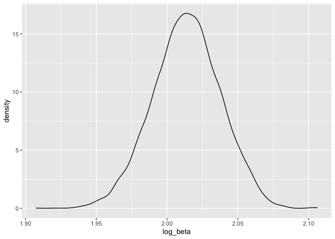

p8105_hw6_xx2416
================
Xicheng Xie
2022-11-29

``` r
library(tidyverse)
library(purrr)
library(modelr)
library(mgcv)
```

# Problem 1

-   Read the dataset

``` r
weather_df = 
  rnoaa::meteo_pull_monitors(
    c("USW00094728"),
    var = c("PRCP", "TMIN", "TMAX"), 
    date_min = "2017-01-01",
    date_max = "2017-12-31") %>%
  mutate(
    name = recode(id, USW00094728 = "CentralPark_NY"),
    tmin = tmin / 10,
    tmax = tmax / 10) %>%
  select(name, id, everything())
```

    ## Registered S3 method overwritten by 'hoardr':
    ##   method           from
    ##   print.cache_info httr

    ## using cached file: ~/Library/Caches/R/noaa_ghcnd/USW00094728.dly

    ## date created (size, mb): 2022-09-29 10:34:26 (8.401)

    ## file min/max dates: 1869-01-01 / 2022-09-30

-   Doing the bootstrap

``` r
weather_boots<-
weather_df %>% 
  bootstrap(n=5000) %>% 
  mutate(
    models=map(strap,~lm(tmax~tmin,data = .x)),
    results1=map(models,broom::tidy),
    results2=map(models,broom::glance))
```

-   Produce estimate of log(beta^0\*beta^1)

``` r
log_beta<-
  weather_boots %>% 
  select(.id,results1) %>% 
  unnest(results1) %>% 
  select(.id,term,estimate) %>% 
  pivot_wider(names_from = "term",
              values_from = "estimate") %>% 
  rename(beta0='(Intercept)',beta1='tmin') %>% 
  mutate(log_beta=log(beta0*beta1)) 

log_beta %>%
  pull(log_beta) %>% 
  quantile(c(0.025,0.975))
```

    ##     2.5%    97.5% 
    ## 1.965426 2.059054

``` r
log_beta %>% 
  ggplot(aes(x=log_beta))+
  geom_density()
```

<!-- -->

-   Produce estimate of r^2

``` r
r_squred<-
  weather_boots %>% 
  select(.id,results2) %>% 
  unnest(results2) %>% 
  select(.id,r.squared)

r_squred %>% pull(r.squared) %>% quantile(c(0.025,0.975))
```

    ##      2.5%     97.5% 
    ## 0.8939865 0.9276002

``` r
r_squred %>% 
  ggplot(aes(r.squared))+
  geom_density()
```

<!-- -->

# Problem 2

-   Read and clean the raw dataset.

``` r
homicide_df<-
  read.csv("homicide-data.csv") %>% 
  mutate(city_state=str_c(city,state,sep=','),
         resolved=as.numeric(disposition=="Closed by arrest"),
         victim_age=as.numeric(victim_age)) %>% 
  filter(!city_state %in% c("Dallas,TX","Phoenix,AZ","Kansas City,MO","Tulsa,AL")) %>%
  filter(victim_race %in% c("White","Black")) 
```

    ## Warning in mask$eval_all_mutate(quo): NAs introduced by coercion

-   Fit a logistic regression for the city of Baltimore,MD

``` r
baltimore_df<-
  homicide_df %>% 
  filter(city_state=="Baltimore,MD") %>% 
  select(resolved, victim_age, victim_race, victim_sex)

fit_logistic<-
  baltimore_df %>% 
  glm(resolved~victim_age+victim_race+victim_sex,data=., family = binomial())

fit_logistic %>% 
  broom::tidy() %>% 
  mutate(OR=exp(estimate),
         CI_lower=exp(estimate-std.error*qnorm(0.975)),
         CI_upper=exp(estimate+std.error*qnorm(0.975))) %>% 
  select(term,OR,starts_with("CI")) %>% 
  knitr::kable(digits = 3)
```

| term             |    OR | CI_lower | CI_upper |
|:-----------------|------:|---------:|---------:|
| (Intercept)      | 1.363 |    0.975 |    1.907 |
| victim_age       | 0.993 |    0.987 |    1.000 |
| victim_raceWhite | 2.320 |    1.648 |    3.268 |
| victim_sexMale   | 0.426 |    0.325 |    0.558 |

Based on the table, the estimate of the adjusted OR for solving
homicides comparing male victims to female victims is `0.426`, and the
95% confidence interval is from `0.325` to `0.558`, which means
homicides in which the victim is male are significantly less likely to
be resolved than those in which the victim is female.

-   Run `glm` for each of the cities in the `homicide_df`, and extract
    the adjusted OR and CI for solving homicides comparing male victims
    to female victims.

``` r
fit_logistic_all<-
  homicide_df %>% 
  nest(data=-city_state) %>% 
  mutate(
    models=map(data,~glm(resolved~victim_age+victim_race+victim_sex,data=.x, family = binomial())),
    results=map(models,broom::tidy)
  ) %>% 
  select(city_state,results) %>% 
  unnest(results) 

# Extract the estimate ORs and CIs for victim_sexMale 
results_victim_sexMale<-
  fit_logistic_all %>% 
  filter(term=="victim_sexMale") %>% 
  mutate(OR=exp(estimate),
         CI_lower=exp(estimate-std.error*qnorm(0.975)),
         CI_upper=exp(estimate+std.error*qnorm(0.975))) %>% 
  select(city_state,OR,starts_with("CI")) 

# Make a plot
results_victim_sexMale%>%
  mutate(city_state=fct_reorder(city_state,OR)) %>% 
  ggplot(aes(x=city_state,y=OR))+
  geom_point()+
  geom_errorbar(aes(ymin = CI_lower, ymax = CI_upper))+
  theme(axis.text.x = element_text(angle = 90, vjust = 0.5, hjust = 1))
```

<!-- -->
